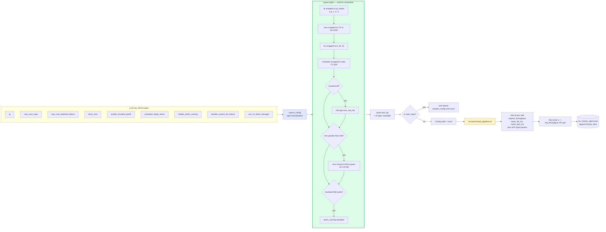
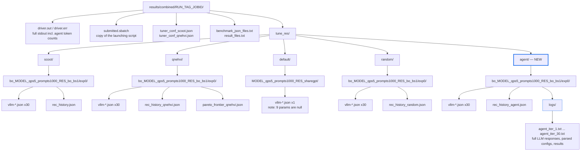
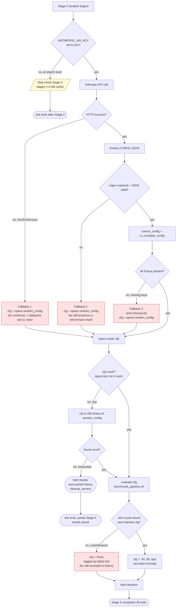

# Stage 5: LLM-Agent Search — Integration Document

This document describes the LLM-Agent search method added to the
`scoot_run/combined/` orchestrator as Stage 5. The agent reuses every
shared piece of the existing 4-stage pipeline (search space, benchmark
runner, history schema, sbatch wrapper) and only swaps the
config-proposal step from `space.random_config()` (Stage 4) or BoTorch
acquisition optimization (Stages 1–2) for a single-shot Anthropic API
call to Claude.

**Audience:** anyone running, modifying, or interpreting results from
the 5-stage pipeline. Read this *after* the top-level `README.md` and
`scoot_run/combined/README.md`.

---

## 1. Where Stage 5 fits in the pipeline

The combined sbatch (`run_configs/combined*.sbatch`) runs five stages
sequentially in a single Slurm allocation. Each stage activates its
required conda env, refreshes `tuner_conf/conf.json` if needed, runs
its method, and triggers `cleanup_between_stages` (kill stale vLLM
servers, free ports 8000–8003) before the next stage starts.

```mermaid
flowchart TD
    Start([sbatch submit]) --> Setup[Allocate GPUs<br/>Validate GPU type<br/>Set RUN_ROOT]
    Setup --> S1

    subgraph S1 ["Stage 1: SCOOT (HEBO + EHVI)"]
        direction TB
        S1env[/conda: scoot-vllm/]
        S1run[bo_scoot.py<br/>30 trials, multi-obj BO]
        S1out[(tune_res/scoot/<br/>rec_history.json)]
        S1env --> S1run --> S1out
    end

    S1 --> S1c[cleanup_between_stages]
    S1c --> S2

    subgraph S2 ["Stage 2: qNEHVI (BoTorch)"]
        direction TB
        S2env[/conda: scoot-botorch/]
        S2run[bo_scoot_qnehvi.py<br/>30 trials, qNEHVI acquisition]
        S2out[(tune_res/qnehvi/<br/>rec_history_qnehvi.json<br/>pareto_frontier_qnehvi.json)]
        S2env --> S2run --> S2out
    end

    S2 --> S2c[cleanup_between_stages]
    S2c --> S3

    subgraph S3 ["Stage 3: vLLM default"]
        direction TB
        S3env[/conda: scoot-vllm/]
        S3run[benchmark_vllm_defaults.sh<br/>1 trial, no tuning]
        S3out[(tune_res/default/<br/>vllm-*.json)]
        S3env --> S3run --> S3out
    end

    S3 --> S3c[cleanup_between_stages]
    S3c --> S4

    subgraph S4 ["Stage 4: Random search"]
        direction TB
        S4env[/conda: scoot-botorch/]
        S4run[random_search.py<br/>30 trials, space.random_config]
        S4out[(tune_res/random/<br/>rec_history_random.json)]
        S4env --> S4run --> S4out
    end

    S4 --> S4c[cleanup_between_stages]
    S4c --> Gate{ANTHROPIC_API_KEY<br/>set?}
    Gate -->|no| Skip[/Log: Skipping Stage 5/]
    Gate -->|yes| S5

    subgraph S5 ["Stage 5: LLM-Agent (Sobol-10 + Opus 4.7)"]
        direction TB
        S5env[/conda: scoot-botorch/]
        S5run[agent_search.py<br/>10 Sobol-init + 20 Opus 4.7<br/>adaptive thinking xhigh]
        S5out[(tune_res/agent/<br/>rec_history_agent.json<br/>logs/agent_iter_*.txt)]
        S5env --> S5run --> S5out
    end

    S5 --> S5c[cleanup_between_stages]
    Skip --> Done
    S5c --> Done([Aggregate file list<br/>benchmark_json_files.txt])

    style S5 stroke:#1f6feb,stroke-width:3px
    style Gate fill:#fff7d6,stroke:#b08800
```



**What's shared across stages:**
- Same 9 parameters with the same valid value sets (the implementations
  differ: Stage 1 uses HEBO's bundled search-space encoding; Stages 2,
  4, 5 use `ScootSearchSpace` in `scoot_run/qnehvi/.../scoot_botorch/space.py`;
  Stage 3 has no search loop).
- All BO/random/agent stages enforce the same hard constraints on every
  config before benchmarking — Stage 1 inside HEBO, Stages 2/4/5 via
  `ScootSearchSpace.repair()`. Empirically this means crashes are rare.
- Same `benchmark_pipeline.sh` (vLLM api_server + ShareGPT client)
- Same 3-objective `obj = [-throughput, ttft_ms, tpot_ms]` schema in `rec_history_*.json`
- Same `tuner_conf/conf.json` (refreshed once per BO/agent stage, contains `min_world_size` and `max_sequence_length`)

**What's unique to Stage 5:**
- Anthropic API call per trial (only network egress in the pipeline)
- Per-iteration reasoning log capturing the LLM's full response
- Optional skip-on-missing-key (other stages have no equivalent gate)

---

## 2. What happens inside one Stage 5 trial

Every iteration of `agent_search.py` follows this fixed flow. The
inputs are the persistent `rec_history_agent.json` (history-so-far)
and the rendered system prompt (`agent_program.md` with placeholders
substituted). The output is one new line in `rec_history_agent.json`

```mermaid
flowchart TD
    Start([LLM iteration N starts<br/>N greater than 10 — Sobol-init done]) --> Load[Load rec_history_agent.json<br/>Build seen_keys set]
    Load --> Build[Build user prompt:<br/>- iteration N of M<br/>- Pareto-frontier callout<br/>- past trials sorted by throughput<br/>- list of tested 9-tuples]
    Build --> Temp{N less than M/2?}
    Temp -->|yes| T1[temperature = 1.0<br/>explore]
    Temp -->|no| T2[temperature = 0.5<br/>exploit]
    T1 --> API
    T2 --> API
    API[client.messages.create<br/>model=claude-opus-4-7<br/>thinking=adaptive, effort=xhigh<br/>system=program.md<br/>user=prompt]

    API --> APIok{API ok?}
    APIok -->|no| Fallback1[response_text = error<br/>cfg = None]
    APIok -->|yes| Parse[extract_config_json<br/>regex 1: CONFIG: marker<br/>regex 2: bare JSON with tp<br/>regex 3: fenced code block]

    Parse --> Parsed{parsed?}
    Parsed -->|no| Fallback2[cfg = None]
    Parsed -->|yes| Coerce[coerce_config<br/>- drop stale keys gmu/enforce_eager/etc<br/>- normalize bools str/int to bool<br/>- cast tp/mns/mbt/bs to int<br/>- cast scheduler_delay_factor to float]

    Coerce --> Complete{all 9 keys?}
    Complete -->|no| Fallback3[print missing keys<br/>cfg = None]
    Complete -->|yes| Repair[space.repair cfg:<br/>- snap tp to tp_values<br/>- snap mns to power-of-2 in 64..8192<br/>- mns less-eq mbt enforced<br/>- chunked XOR prefix-caching<br/>- if not chunked, mbt geq max_seq_len]

    Fallback1 --> RandomFB
    Fallback2 --> RandomFB
    Fallback3 --> RandomFB
    RandomFB[cfg = space.random_config<br/>already-repaired]

    Repair --> Dedup{space.key cfg in seen?}
    RandomFB --> Dedup
    Dedup -->|yes, duplicate| Resample[Up to 256 random_config<br/>draws until unique]
    Dedup -->|no, novel| AddSeen
    Resample --> Exhausted{found unique?}
    Exhausted -->|no| Stop([Stop: space exhausted])
    Exhausted -->|yes| AddSeen
    AddSeen[seen.add space.key cfg<br/>persist agent_iter_N.txt]

    AddSeen --> Bench[evaluate cfg<br/>= cleanup_servers<br/>+ benchmark_pipeline.sh<br/>+ find_matching_result]
    Bench --> Result{result is not None?}
    Result -->|yes| Obj[y = -req_throughput,<br/>mean_ttft_ms,<br/>mean_tpot_ms]
    Result -->|no, crashed/timeout| ObjNone[y = None<br/>logged as failed trial]

    Obj --> Persist
    ObjNone --> Persist
    Persist[history.append history_item<br/>save_history rec_history_agent.json]

    Persist --> Loop{N less than num_trials?}
    Loop -->|yes| Start
    Loop -->|no| Final([cleanup_servers, exit])

    style API fill:#dbeafe,stroke:#1f6feb,stroke-width:2px
    style Repair fill:#dcfce7,stroke:#16a34a,stroke-width:2px
    style Bench fill:#fef3c7,stroke:#b08800,stroke-width:2px
    style Stop fill:#fee2e2,stroke:#dc2626
```

plus one file under `logs/agent_iter_<N>.txt`.



**Three things to notice:**
1. **Every path leads through `repair()`.** Whether the LLM produced
   a perfect config, a malformed one, or nothing at all, the config
   that hits vLLM is always constraint-valid. This is what makes the
   comparison fair against the BO methods that are similarly bounded.
2. **No retries.** If the API errors, the iteration falls back to
   random rather than burning wall time on backoff. Visible in
   `driver.out` as `LLM API error: ...`.
3. **History is the only memory.** The Anthropic call is single-shot
   with no chat history; everything the agent "knows" is reconstructed
   from `rec_history_agent.json` at the start of each iteration.

---

## 3. The 9-parameter search space and `repair()`

All 5 stages tune the same 9 parameters with the same valid value
sets. Stages 2, 4, and 5 share the `ScootSearchSpace` implementation
in `scoot_run/qnehvi/.../scoot_botorch/space.py` (with `random_config()`,
`repair()`, `key()`, `encode()`, `decode()`). Stage 1 has its own
HEBO-based encoding of the same parameters; Stage 3 hits a single
hard-coded vLLM-default config and has no search loop. The flow below
documents Stage 5's path; Stages 2 and 4 follow the same shape.



**Critical implication for comparison fairness:** because every
method funnels through `repair()`, the friend's prior 4×A6000 baselines
had **zero failed configurations** in 30 trials each. The
"domain-knowledge-avoids-crashes" advantage that motivates
LLM-as-optimizer in some literature is structurally neutralized here.
The 5-way comparison measures Pareto sample efficiency, not crash
avoidance. (See §6.)

---

## 4. Output layout — what lands on disk

After one full sbatch run, the run directory contains 121 vLLM result
files (30 + 30 + 1 + 30 + 30 if Stage 5 ran), four `rec_history_*.json`
aggregate files, and the agent's per-iteration reasoning logs.



**Schema invariant across `rec_history_*.json`:** each entry has the
following shape (illustrative, not literal JSON — placeholders in
angle brackets):

```text
{
  "rec":      [<9-param config dict>],
  "obj":      [<-throughput>, <ttft_ms>, <tpot_ms>]   // null on failure
  "rec_time": 0.0,
  "run_time": <seconds>
}
```

This makes the post-run comparison a one-liner: load four
`rec_history_*.json` files, pool the `obj` arrays, compute the union
Pareto frontier.

---

## 5. Decision flow — what happens when something goes wrong

The agent has three classes of "things that can go wrong" mid-run.
Each has a defined fallback so the run never aborts mid-pipeline (a
silent abort would leak a partially-cleaned vLLM server and waste GPU
hours).



**Implication for run quality:** a Stage 5 with persistent API
failures degenerates to a pure random-search run, which is then
indistinguishable from Stage 4. If you suspect this, grep
`driver.out` for `LLM API error:` — three or more in a 30-trial run
means the Stage 5 numbers are not really an "agent" measurement.

---

## 6. Comparison interpretation guide

A typical run produces 4 sets of comparable trials (SCOOT, qNEHVI,
Random, Agent — all 30 each, all repaired) plus one default. Three
analyses are worth running.

### 6.1 Per-objective bests

```python
import json, glob
runs = {}
for stage, fname in [
    ("scoot",  "rec_history.json"),
    ("qnehvi", "rec_history_qnehvi.json"),
    ("random", "rec_history_random.json"),
    ("agent",  "rec_history_agent.json"),
]:
    p = glob.glob(f"tune_res/{stage}/bo_*/exp0/{fname}")
    if not p:
        continue
    runs[stage] = json.load(open(p[0]))

print(f"{'method':10s} {'best thr':>10s} {'best TTFT':>10s} {'best TPOT':>10s} {'failed':>7s}")
for s, h in runs.items():
    objs = [item["obj"] for item in h if item.get("obj") is not None]
    failed = sum(1 for item in h if item.get("obj") is None)
    if objs:
        print(f"{s:10s} {max(-o[0] for o in objs):10.2f} "
              f"{min(o[1] for o in objs):10.1f} "
              f"{min(o[2] for o in objs):10.1f} "
              f"{failed:7d}")
```

This tells you per-objective winners but **does not** measure
multi-objective performance.

### 6.2 Pooled Pareto frontier

The proper 5-way comparison: pool all `obj` vectors across methods,
compute the union Pareto frontier, then count how many frontier
points each method contributed. The method with the most frontier
contributions is the most Pareto-efficient at this budget.

```python
def is_dominated(a, others):
    return any(
        all(b[i] <= a[i] for i in range(3)) and any(b[i] < a[i] for i in range(3))
        for b in others if b is not a
    )

pool = []  # (method, obj)
for s, h in runs.items():
    for item in h:
        if item.get("obj") is not None:
            pool.append((s, item["obj"]))

frontier = [(s, o) for s, o in pool if not is_dominated(o, [b for _, b in pool])]
from collections import Counter
print("Frontier contributions:", Counter(s for s, _ in frontier))
```

### 6.3 Convergence by iteration

Plot best-so-far throughput (and best TTFT / best TPOT) as a function
of trial number, one curve per method. The BO methods (SCOOT and
qNEHVI) typically begin to surface non-trivial configs after their
initialization phase (~5–10 trials of Sobol/random init for qNEHVI;
HEBO's bundled init for SCOOT); random's best-so-far improves
erratically and plateaus; the agent's curve is the new datapoint to
interpret. The `logs/agent_iter_N.txt` files record what the agent
*was thinking* at each step — useful when its trajectory is unusual.

---

## 7. Things this integration deliberately doesn't do

This list is short on purpose. Each item is either out-of-scope per
the design or rejected with a stated reason.

| Not done | Why |
|---|---|
| ~~Sobol warm-start~~ — **REVISED**: Sobol-10 warm-start IS now done | Original integration was pure-cold-start. Later upgraded to Sobol-10 (matching qNEHVI's `--sobol_init=10`) to close the init-phase fairness gap and maximize the agent's win-likelihood vs qNEHVI. Method is now labeled **"Agent (Sobol-10 + Opus 4.7 adaptive xhigh)"** — explicitly disclosed as a hybrid in the same family as `centaur_search.py` (init-then-LLM, not alternating). See §1 pipeline overview and `combined/README.md` design notes. |
| LLAMBO-style hybrid (LLM-proposed candidates re-ranked by GP surrogate) | Different method from "Agent" — would be a separate paper baseline. Tracked as Path B if pure agent + Sobol-10 + Opus 4.7 doesn't dominate; not implemented in this iteration. |
| Hypervolume-based ranking in the prompt | The HV reference point is empirically chosen even in qNEHVI (`min(Y) − 0.1·span(Y)`); copying that into the prompt would propagate an unprincipled choice. Pareto-frontier callout exposes the same information without committing to a scalar. |
| Prompt caching for the system prompt | <$1 cost per run; optimization not needed. Add `cache_control: ephemeral` to the system block if running many sweeps. |
| Retry-with-backoff on API errors | Per-iteration fallback to random keeps the run progressing; sustained outage degrades to random search and is visible in `driver.out`. |
| MLflow / W&B logging | None of the other 4 stages log there; adding to Stage 5 only would create asymmetric observability. Per-iteration `agent_iter_*.txt` covers the same need. |
| Cross-stage `summarize.py` post-processor | Listed as known TODO in the friend's CLAUDE.md §9. Not blocking the agent integration. |
| SLO-stability re-test (paper §16) | Separate piece of work; unrelated to which method picks the configs. |

---

## 8. Operational quick-reference

| Question | Answer |
|---|---|
| Does Stage 5 need a different conda env? | No — same `scoot-botorch` as Stages 2 and 4. Just add `pip install 'anthropic>=0.96'` (need ≥0.96 for Opus 4.7 + adaptive thinking + `output_config`). |
| What model does Stage 5 use? | `claude-opus-4-7` (default) with `thinking={"type": "adaptive"}` and `output_config={"effort": "xhigh"}`. To use Sonnet 4.6 instead, pass `--llm_model claude-sonnet-4-6` and change `xhigh` → `max` in [`agent_search.py`](../agent_search.py) (xhigh is Opus 4.7-only). |
| Does Stage 5 use a warm-start? | Yes. First 10 trials are Sobol-init (matching qNEHVI's `--sobol_init=10` default) for fair init-phase parity. Trials 11-30 are LLM-proposed. Method is labeled **"Agent (Sobol-10 + Opus 4.7 adaptive xhigh)"**, not pure agent. |
| Where do I put the API key? | Recommended: copy `env.sh.example` (project root) to `env.sh`, paste your key, `chmod 600`. The sbatch auto-sources it. Alternative: `export ANTHROPIC_API_KEY=...` in the submitting shell. `env.sh` is gitignored and never shipped. |
| What if I don't have an API key? | Stage 5 logs "Skipping" and the job still produces stages 1–4. No re-run needed. |
| What's the expected wall-time? | ~3 h for Stage 5 alone (10 Sobol benchmarks + 20 LLM-proposed benchmarks). ~9-10 h end-to-end for the 5-stage sbatch. |
| Expected API cost? | ~$10-15 per run with `claude-opus-4-7` at `xhigh` effort. Thinking tokens billed at output rate ($25/MTok). The 10 Sobol-init trials cost zero API. |
| How do I resume a partial Stage 5? | Re-run `agent_search.py` with the same `RES_DIR_PATH` — it reads `rec_history_agent.json` and skips already-recorded trials. The Sobol warm-start phase is also resumable. |
| How do I read what the agent was thinking on iteration N? | `tune_res/agent/bo_*/exp0/logs/agent_iter_N.txt` — but **only for N ≥ 11** (the LLM phase). Trials 1–10 are Sobol quasi-random samples with no LLM call, so no reasoning log exists for them; their configs are recorded only in `rec_history_agent.json` and `vllm-*.json`. With adaptive thinking enabled, the response object's `thinking` blocks are summarized by Anthropic and would need a separate dump if you want the chain-of-thought; the visible text response (the chosen CONFIG + reasoning) IS persisted in `agent_iter_N.txt`. |
| How do I compare methods after a run? | Load the four `rec_history_*.json` files; see §6. |
| Is Stage 5 reproducible? | Sobol warm-start (first 10 trials) IS deterministic with `--seed 42`. The LLM phase (trials 11-30) is NOT bit-reproducible — Anthropic API has no deterministic seed even at temperature=0. Document run-to-run variance for the LLM-proposed trials when reporting. |

---

## 9. References

- [`agent_search.py`](../agent_search.py) — the orchestrator (~500 LOC)
- [`agent_program.md`](../agent_program.md) — system-prompt template
- [`_bench_runner.py`](../_bench_runner.py) — shared with Stage 4
- [`scoot_botorch/space.py`](../../qnehvi/SCOOT-SLO-Oriented-Performance-Tuning/scoot_botorch/space.py) — `ScootSearchSpace`, `repair()`, `key()`
- [`scoot_botorch/history.py`](../../qnehvi/SCOOT-SLO-Oriented-Performance-Tuning/scoot_botorch/history.py) — `history_item`, `load_history`, `save_history`
- [Anthropic Messages API docs](https://platform.claude.com/docs/en/api/messages)
- [Claude model overview](https://platform.claude.com/docs/en/about-claude/models)
